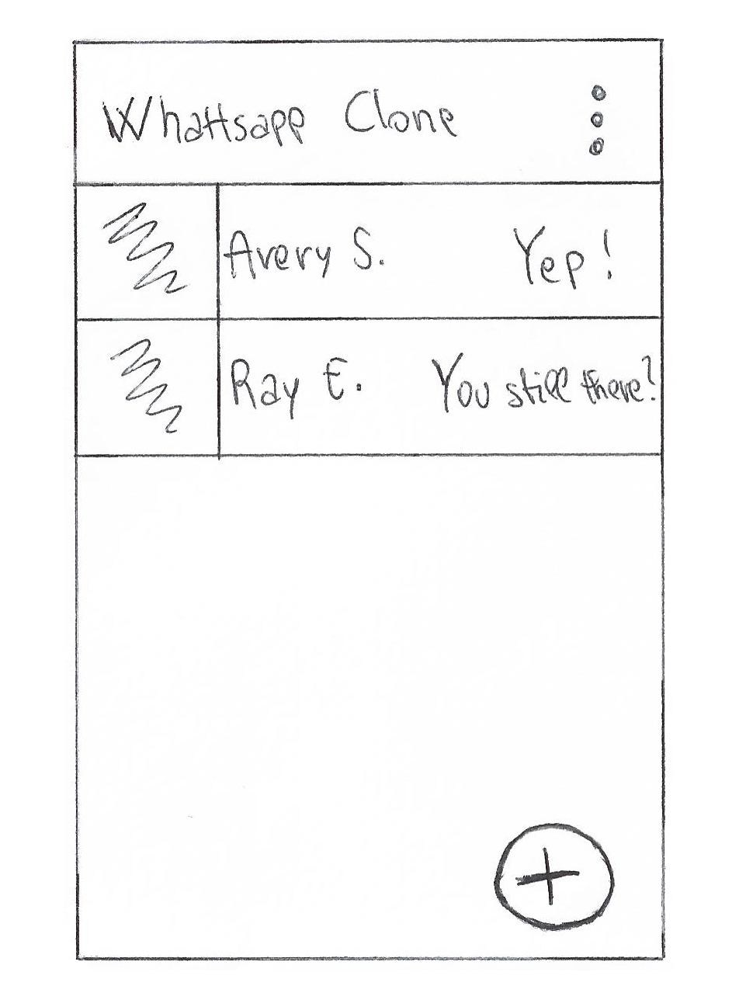
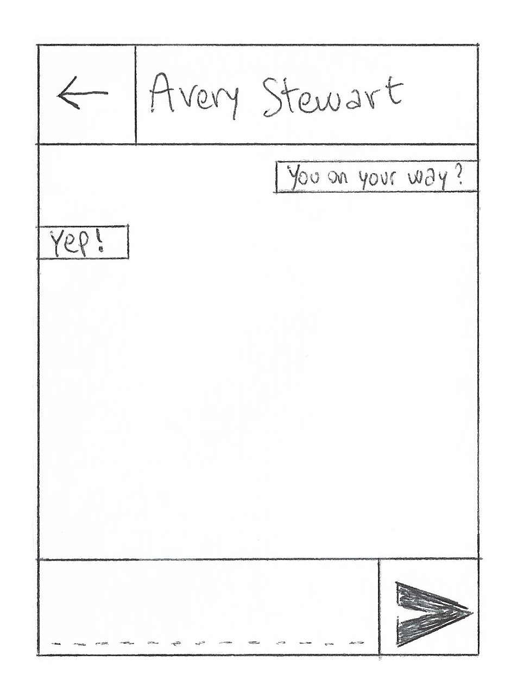
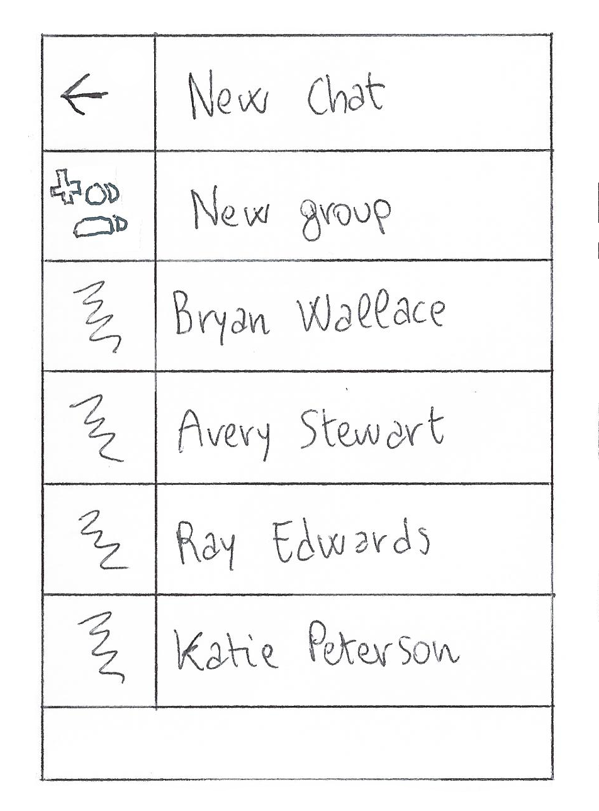
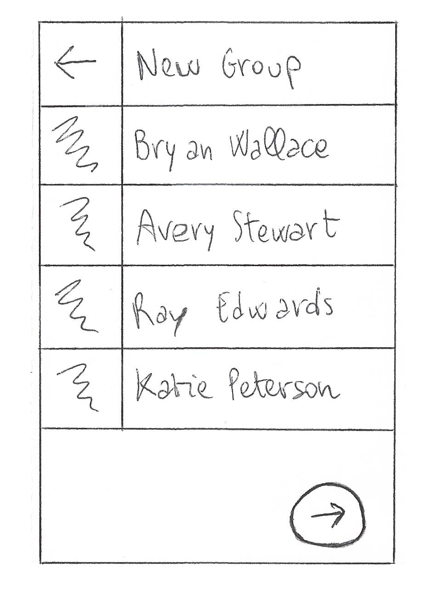
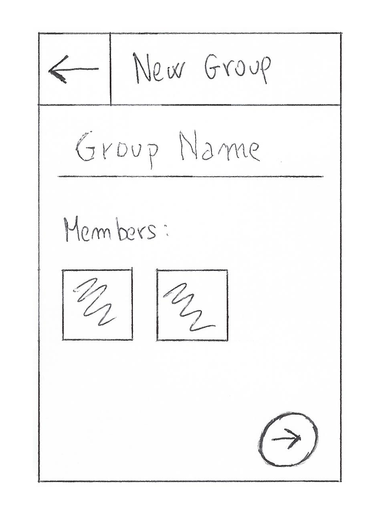
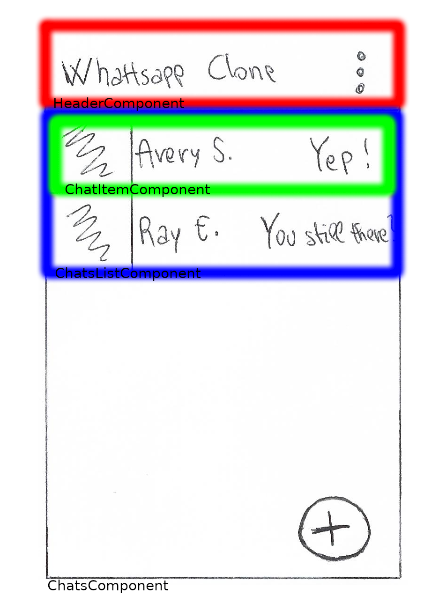
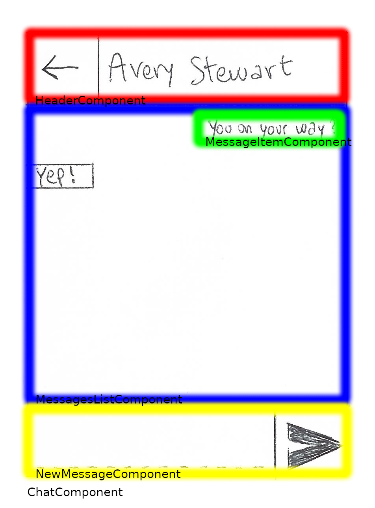
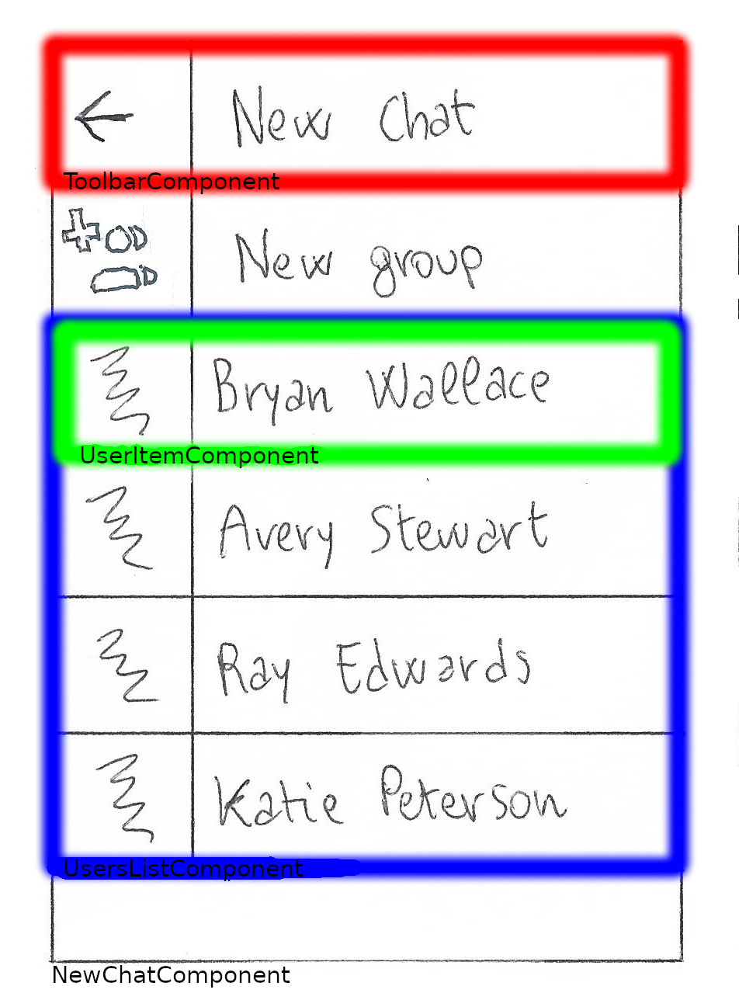
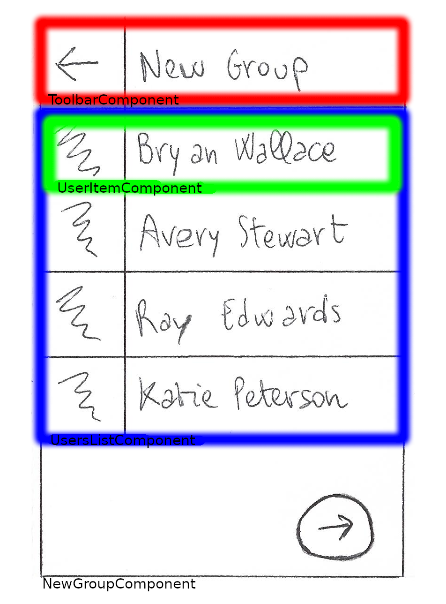
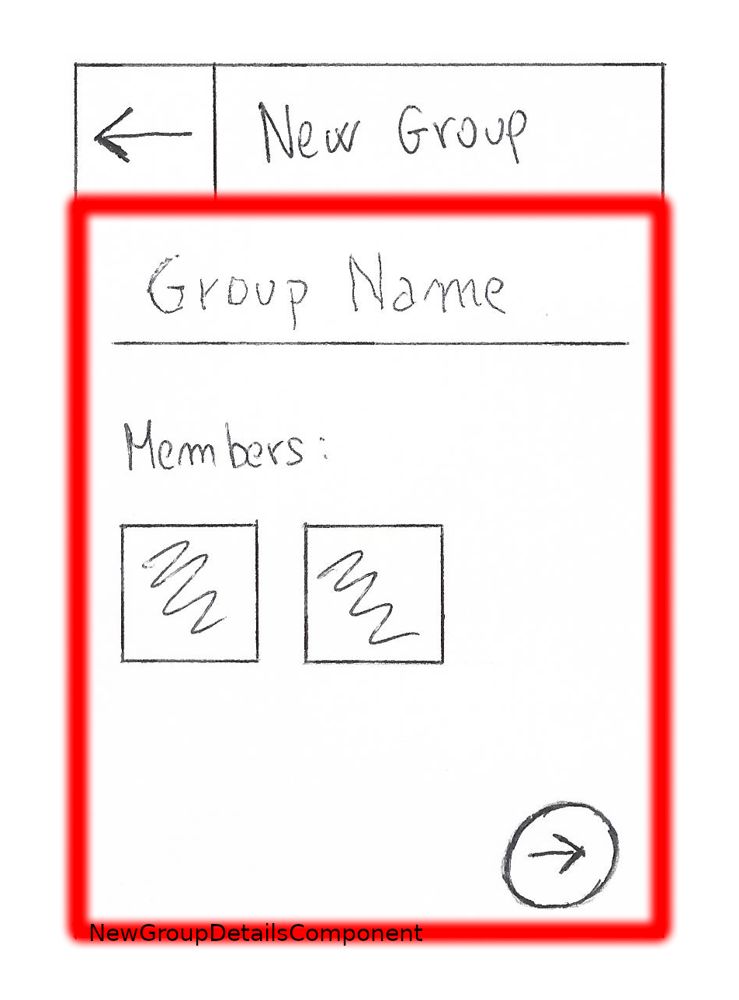

# Step 2: Planning process

[//]: # (head-end)

## Visual sketch
Well, not a lot to say about that: just draw your app on paper.
Doesn’t matter if you don’t know how to draw, it’s just squares and circles.

## Breaking down to components
### -> Google Search
This part is a bit more tricky, but after a few examples you’ll get the hang of it.

Draw boxes around every component and subcomponent in different colors and name each one.
But how do you know what should be its own component?
Just follow the **single responsibility principle**, that is, a component should ideally only do one thing. If it ends up growing, it should be decomposed into smaller subcomponents.

  * Chats Component
  * Header Component
  * ChatsList Component
  * ChatItem Component
  * Chat Component
  * MessagesList Component
  * MessageItem Component
  * NewMessage Component
  * NewChat Component
  * UsersList Component
  * UserItem Component
  * NewGroup Component
  * NewGroupDetails Component

Now let’s organize them in hierarchy:
* Chats
  * Header
  * ChatsList
    * ChatItem
* Chat
  * Header
  * MessagesList
    * MessageItem
  * NewMessage
* NewChat
  * Header
  * UsersList
    * UserItem
* NewGroup
  * Header
  * UsersList
    * UserItem
  * NewGroupDetails

## Layout
### -> Google Search
Now let’s describe how the components are placed within each other.
There are infinite ways to explain how components sits inside of each other.
Any approach has its benefits and limitations.
We are going to use one pattern that is pretty common, simple and also covers many types of UI structures. 
Using that pattern we will keep us covered for a long while (until you would want to create a computer game or a graph. then you’ll need to expand your horizons).
This pattern is called flexbox.

In Flexbox we can separate the alignment in two ways:
Container (parent) component behaviour
Child component behaviour inside the container

When describing the parent, we have 3 main properties:
* Flex-Flow: it's a shorthand for flex-direction and flex-wrap and lets you control the direction in which the items are displayed and whether or not they can wrap onto the next line. There are four possible settings, each of them in the wrap or 
nowrap variant:
  * row `[wrap, nowrap]`
  * row-reverse `[wrap, nowrap]`
  * column `[wrap, nowrap]` - this is the normal way a group of divs would be displayed, so you might not use this often
  * column-reverse `[wrap, nowrap]`
* Justify-content: determines where a browser should place the flex items within the row. It works only if the flex items have set widths and if the total width of the items is less than the flex container. There are five possible settings:
  * Flex-start - squash them to the left
  * Center - Squash them to the center
  * Flex-end - squash them to the right
  * Space-around - squash them away from each other and the ends. Place as much space as possible between all elements
  * Space-between - Squash the sides to the ends and place as much space between the rest of the elements as possible
* alignItems: Same as justifyContent but on the secondary axis
  * Flex-start - squash them to the left
  * Center - Squash them to the center
  * Flex-end - squash them to the right
  * Space-around - squash them away from each other and the ends. Place as much space as possible between all elements
  * Space-between - Squash the sides to the ends and place as much space between the rest of the elements as possible

The easiest way to explain that is by showing live examples:
[awaiting for McFarland's permission to share his pictures]

## Data dependencies
### -> Google Search
Our app needs to display data. Otherwise it will be just a nice moving set of pictures…
So let’s see what data each component needs and create a descriptions of all the data in our app.

Let’s start with the chats list component:

* Chats: Chats, Users, Messages
  * Header
  * ChatsList: Chats, Users, Messages
    * ChatItem: Chats`[chatId]`, Users`[UserId]`, Message`[messageId]`

We need to have some basic information about the chats we are part of, like the chat id, the user id and the latest message content.
That means we will have to query for all the chats who we are part of, then look at the user IDs and query for those users to retrieve the name. Finally we need to query for the last message of each chat.

Now let’s talk about the chat component (after clicking the single chat app).
We need a list of all the messages inside the chat, along with some info about the user or chat on the top corner:

* Chat: Chat, User, Messages
  * Header: User.name || Chat.name (Because we can have multiple participant could differ from the other person’s name)
  * MessagesList: Messages
    * MessageItem: Messages`[ID]`
  * NewMessage

The NewChat and NewGroup components will need just some basic info about the user:

* NewChat: Users
  * Header
  * UsersList: Users
    * UserItem: Users`[ID]`

* NewGroup: Users
  * Header
  * UsersList: Users
    * UserItem: Users`[ID]`
  * NewGroupDetails

## Actions
### -> Google Search
But components can also do thing beyond just displaying data. 
Let’s write all the actions each component can do.
  * Chats list
    * tap -> go to chat page
    * press -> enable selection of multiple chats, confirming the selection will delete them
  * Single Chat
    * tap -> send the message
    * press -> enable selection of multiple messages, confirming the selection will delete them
  * New Chat
    * tap -> create new chat or go to the NewGroup component
  * New Group
    * tap -> go to NewGroupDetails, then create the group

## Communications
### -> Google Search
Let’s define when do we need to get the data from our data source.
Sounds easy but there are a few tricky pitfalls. (query and subscriptions).
We will start by simply requesting the data when we first start the component, later on we will tackle subscriptions.

## UI flow
### -> Google Search
Let’s draw a diagram of how the user can navigate our app.
  * Open the app ->
    * Chats list ->
      * Click on chat ->
        * Specific chat page
          * Click back ->
            * Chat page
    * Click on '+' ->
      * NewChat page ->
        * Click on user ->
          * Chat page
        * Click back ->
          * Chats list
        * Click on 'New Group' ->
          * New Group page
            * Multiple selection and subsequent confirmation ->
              * NewGroupDetails page
                * Insert name and click on confirm ->
                  * Chat page
              * Click back ->
                * New Group page
          * Click back ->
            * New Group page

Now let’s look at the whole diagram we created.
That basically describes all of our app.
If computers were smart enough to understand english and drawings, we would have an app by now.
But programming languages are very similar to regular languages so we now just need to translate this into any programming language, just choose a tool and start filling in the gaps.

Next chapter will be about Scaffolding which will tell us the structure to put our code into.
Just like our sketch has defined parts, we would do the same just with folders and files.

[//]: # (foot-start)

[{]: <helper> (navStep)

| [< Previous Step](step1.md) | [Next Step >](step3.md) |
|:--------------------------------|--------------------------------:|

[}]: #
